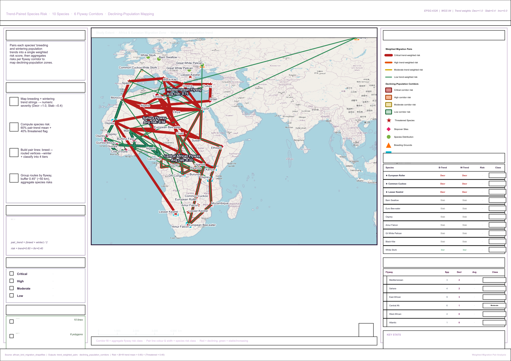

# African Bird Migration — Weighted Migration Pair Analysis

> **A population-trend-driven analysis** that pairs each species' breeding and
> wintering populations into a single weighted risk score, then aggregates these
> scores per flyway corridor to identify which migration corridors carry the
> highest concentration of declining-population species.

---

## Project Overview

| Property | Value |
|---|---|
| **Project file** | `African_Bird_Weight_Migration_Pair.qgz` |
| **CRS** | EPSG:4326 — WGS 84 |
| **Species analysed** | 10 |
| **Flyway corridors scored** | 6 |
| **Corridor buffer** | 0.45° (≈ 50 km) |

## Folder Structure

```
African_Bird_Weight_Migration_Pair/
├── African_Bird_Weight_Migration_Pair.qgz
├── README.md
├── Input_layers/   (6 source GeoPackages)
└── Output_layer/
    ├── trend_weighted_pairs.gpkg          (10 LineStrings)
    ├── declining_population_corridors.gpkg (6 polygons)
    └── reference_layout.png               (1.88 MB · A3 · 200 dpi)
```

## Trend Scoring & Risk Formula

```
Decreasing  =  1.0
Stable      =  0.4
Increasing  =  0.0

pair_trend = (breed_trend + winter_trend) / 2
risk       = pair_trend × 0.60 + threatened × 0.40
```

## Classification Thresholds

| Class | Score | Colour |
|---|---|---|
| Critical | ≥ 0.70 | `#b71c1c` |
| High | ≥ 0.45 | `#e65100` |
| Moderate | ≥ 0.25 | `#d4ac0d` |
| Low | < 0.25 | `#1e8449` |

## Per-Species Risk Scores

| Species | Threatened | Breeding | Wintering | Risk | Class |
|---|---|---|---|---|---|
| European Roller | ★ | Decreasing | Decreasing | **1.000** | Critical |
| Common Cuckoo | ★ | Decreasing | Decreasing | **1.000** | Critical |
| Lesser Kestrel | ★ | Decreasing | Decreasing | **1.000** | Critical |
| Barn Swallow | — | Stable | Stable | 0.240 | Low |
| European Bee-eater | — | Stable | Stable | 0.240 | Low |
| Osprey | — | Stable | Stable | 0.240 | Low |
| Amur Falcon | — | Stable | Stable | 0.240 | Low |
| Great White Pelican | — | Stable | Stable | 0.240 | Low |
| Black Kite | — | Stable | Stable | 0.240 | Low |
| White Stork | — | Increasing | Increasing | 0.000 | Low |

## Per-Corridor Risk

| Flyway | Spp | Decl | Thr | Avg Risk | Class |
|---|---|---|---|---|---|
| **Mediterranean Flyway** | 3 | 2 | 2 | **0.747** | 🔴 Critical |
| **Sahara Flyway** | 4 | 2 | 2 | **0.560** | 🟠 High |
| **East African Flyway** | 9 | 3 | 3 | **0.467** | 🟠 High |
| Central African Flyway | 6 | 1 | 1 | 0.327 | 🟡 Moderate |
| West African Flyway | 4 | 0 | 0 | 0.240 | 🟢 Low |
| Atlantic Flyway | 1 | 0 | 0 | 0.240 | 🟢 Low |

## Methodology

### Phase 1 — Trend Mapping
Convert breeding and wintering trend strings to numeric severity scores.

### Phase 2 — Per-Species Risk
Combine pair trend with threatened flag (60/40 weighting).

### Phase 3 — Pair Line Geometry
Build LineString per species: breeding → dissolved route vertices → wintering.
Total distance via Haversine.

### Phase 4 — Corridor Aggregation
Group routes by `flyway` field (not by species). Buffer each flyway by 0.45° (~50 km).
Average species risk per corridor → corridor risk class.

## Key Findings

- All 3 declining species are also threatened, with both breeding AND wintering
  trends Decreasing — maximum risk score (1.000) and a perfect signal alignment.
- **Mediterranean Flyway** is the highest-risk corridor (avg 0.747) despite hosting
  only 3 species — because 2 of those 3 are critically declining.
- **East African Flyway** has the most absolute exposure (3 declining species),
  but its risk is diluted by 6 stable-population species also using it.
- **White Stork** is the only Increasing-trend species — possible conservation
  success story.
- 3 flyways above the Moderate threshold together carry every declining species.

---

*African Bird Migration — Weighted Migration Pair Analysis*
*Risk: pair_trend × 0.60 + threatened × 0.40  ·  Buffer 0.45° (~50 km)*

---

## Map Preview



